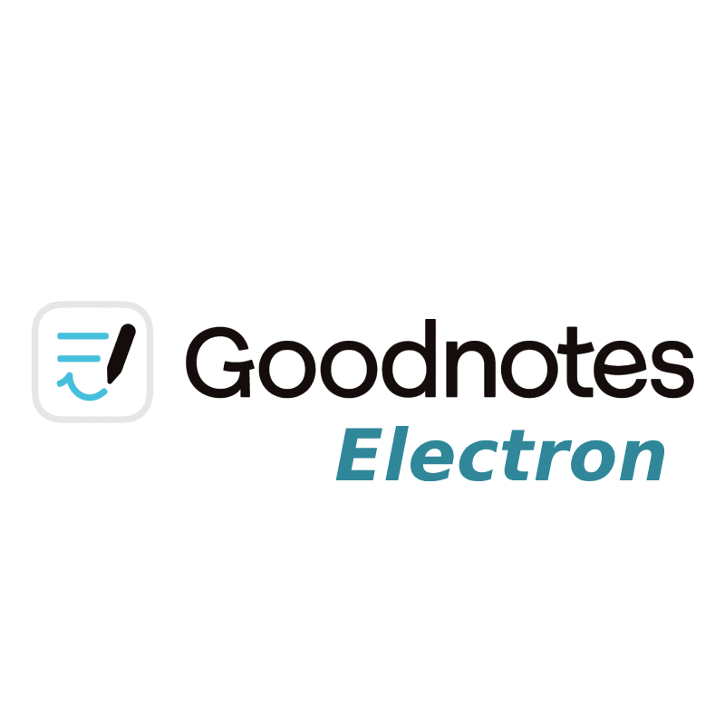

# GoodNotes Electron

Unofficial [GoodNotes Web](https://web.goodnotes.com) desktop wrapper using Electron.



This project wraps the official GoodNotes web version in a standalone desktop app with system tray support, better native integration, and theming improvements.

---

## Features

- Runs GoodNotes Web as a native desktop application
- Electron-based minimal wrapper
- System tray integration
- Persistent window state and native menu
- Desktop entry for Linux (tested on Arch/Hyprland)

---

## Installation

### Arch Linux (via AUR)

```bash
yay -S goodnotes-electron
```

Or clone and install manually:

```bash
git clone https://aur.archlinux.org/goodnotes-electron.git
cd goodnotes-electron
makepkg -si
```


<!--
## AUR Packaging & Publishing

If you want to maintain or submit this to the AUR:

Make sure your PKGBUILD is updated.

Regenerate the .SRCINFO file using:

```bash
makepkg --printsrcinfo > .SRCINFO
```

Then commit and push:

```bash
git add PKGBUILD .SRCINFO
git commit -m "Update to version X.Y.Z"
git push
```

> This ensures the AUR package metadata remains in sync with the PKGBUILD.
-->
